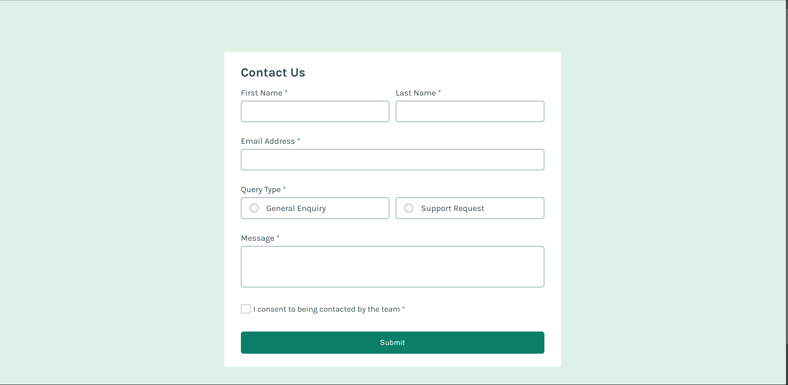

# Frontend Mentor - Contact form solution

This is a solution to the [Contact form challenge on Frontend Mentor](https://www.frontendmentor.io/challenges/contact-form--G-hYlqKJj). Frontend Mentor challenges help you improve your coding skills by building realistic projects.

## Table of contents

- [Overview](#overview)
  - [The challenge](#the-challenge)
  - [Screenshot](#screenshot)
  - [Links](#links)
- [My process](#my-process)
  - [Built with](#built-with)
  - [What I learned](#what-i-learned)
  - [Continued development](#continued-development)
  - [Useful resources](#useful-resources)
- [Author](#author)

## Overview

### The challenge

Users should be able to:

- Complete the form and see a success toast message upon successful submission
- Receive form validation messages if:
  - A required field has been missed
  - The email address is not formatted correctly
- Complete the form only using their keyboard
- Have inputs, error messages, and the success message announced on their screen reader
- View the optimal layout for the interface depending on their device's screen size
- See hover and focus states for all interactive elements on the page

### Screenshot

### Links

- Solution URL: [Solution URL](https://www.frontendmentor.io/solutions/basic-contact-form-T3t9AbJpR1)
- Live Site URL: [Live site URL](https://mike-kay.github.io/03-contact-form-main/)

## My process

### Built with

- Semantic HTML5 markup
- CSS custom properties
- Flexbox
- CSS Grid
- Mobile-first workflow
- Vanilla Javascript

### What I learned

My major learning landmark regarding this project was basic web accessibility. I got exposed to another side of the web which uses the screen reader technology, and it was fun overcoming the challenges i encountered while trying to apply this technogy to building the project.

### Continued development

I think i have only scratched the surface for the minimum that was required to complete this challenge, i hope to learn more about web accessibilty.

### Useful resources

- [Guide To Accessible Form Validation](https://www.smashingmagazine.com/2023/02/guide-accessible-form-validation/) - This is a simple guide to accessible form validation, it was really helpful.

## Author

- Frontend Mentor - [@Mike-Kay](https://www.frontendmentor.io/profile/Mike-Kay)
- Twitter - [@Mike_Kay1](https://www.twitter.com/@Mike_Kay1)
